# A Geologic Map of Mars

[](https://www.gnu.org/licenses/gpl-3.0)
[](https://twitter.com/eleanor_lutz)
[](https://github.com/eleanorlutz)

This repository explains how to make a geologic map of Mars using open-source data from the [USGS](https://www.usgs.gov/centers/astrogeo-sc/data-tools), [IAU](https://planetarynames.wr.usgs.gov/), and [NASA](https://solarsystem.nasa.gov/). Software used includes `Python 3.7.1`, `GDAL 2.4.1`, `Illustrator CC 2019` and `Photoshop CC 2019`. If you have comments or suggestions for this tutorial, please let me know [on my blog](http://tabletopwhale.com/2019/06/24/a-geologic-map-of-mars.html)! You can buy [the finished map here](https://www.redbubble.com/people/eleanorlutz/works/39615820).

**Python dependencies:** `matplotlib` `numpy` `pandas` `cartopy` `jupyter`. Dependencies can be installed with `pip install -r requirements.txt`.

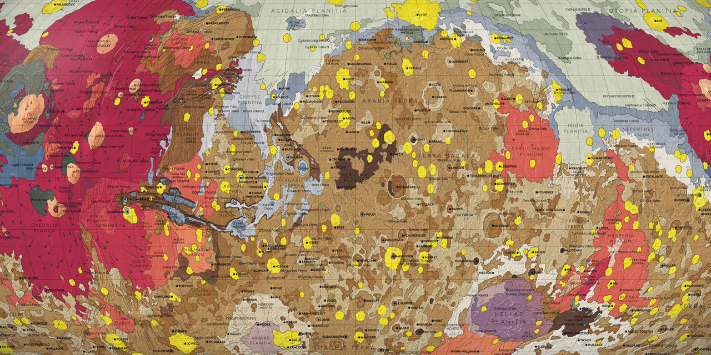

## Special instructions for beginners

##### If you're new to coding:

[Software Carpentry](https://software-carpentry.org/) has great tutorials for [installing Python](https://carpentries.github.io/workshop-template/) (scroll down and follow the directions in  the Bash Shell and Python sections), [getting starting with Jupyter Notebooks](http://swcarpentry.github.io/python-novice-inflammation/setup/index.html), and [beginner-friendly Python programming](http://swcarpentry.github.io/python-novice-inflammation/aio/index.html). After you've installed Python using these tutorials, you can use [Git Desktop](https://desktop.github.com/) and the instructions in [this tutorial](https://help.github.com/en/desktop/contributing-to-projects/cloning-a-repository-from-github-desktop) to download the code and data in this tutorial. For the code in this repository you will also need to install [GDAL](https://gdal.org/download.html). The instructions in this document under the "Conda" section are probably the most relevant if you've installed Python as described above.

##### If you're new to design:

You'll need software for editing raster and vector images ([this article](https://vector-conversions.com/vectorizing/raster_vs_vector.html) explains the difference). I use [Adobe Photoshop](https://www.adobe.com/products/photoshop.html) and [Illustrator](https://www.adobe.com/products/illustrator.html), but you can also use the free open-source programs [Gimp](https://www.gimp.org/downloads/) and [Inkscape](https://inkscape.org/release/inkscape-0.92.4/). There is no perfect software that fits everyone's needs, so you'll want to understand the pros and cons for the different [raster](https://www.colorexpertsbd.com/blog/brief-comparison-photoshop-gimp) and [vector](https://logosbynick.com/inkscape-vs-illustrator-vs-coreldraw/) programs before choosing.

## Table of Contents

1. [Gathering and processing data](#data)
2. [Map design in Python](#python)
3. [Map design in Illustrator and Photoshop](#illustrator_photoshop)
4. [References](#references)
5. [License](#license)

<a name="data"/>

## Gathering and processing data

#### Digital Elevation Models
Digital Elevation Models (DEMs) are data files that provide height information about different locations on the planet or moon. In this project I used a DEM for [Mars](https://astrogeology.usgs.gov/search/map/Mars/Topography/HRSC_MOLA_Blend/Mars_HRSC_MOLA_BlendDEM_Global_200mp_v2) provided by the United States Geologic Survey. Each pixel in this `GeoTIFF` files is a signed 16-bit integer that describes the elevation at that specific location on the planet.

**Note:** Many software programs can't read this kind of file, so it's normal if the DEM looks strange in Preview or other default image applications. I work with these DEM files in `GDAL` (short for Geospatial Data Abstraction Library).

#### Map Projections
**A Quick Introduction:** Before we get into the details of map projection transformations, here's a quick overview of what this actually means. To map a 3D object in 2D space, the surface must be transformed using a map projection. There are many different projections, and for the maps in the *Atlas of Space* series I used Eckert IV, Orthographic, and Plate Carree projections. To compare these different map projections, you can use a Tissot's indicatrix - a set of circles of the same size plotted at different places on the globe. All map projections distort space, but you can see that the effects are quite different depending on the projection:


The choice of projection depends on the purpose of the map. For example, the Eckert IV projection preserves area measurements, so I used Eckert IV in the main geologic map to show how much area on the planet was made up of each type of rock. For the smaller inset maps in each corner, I used an Orthographic projection to visualize what each hemisphere of the planet might look like when seen from outer space.

**Changing the Map Projection of a DEM File:** The original DEM data file uses a Plate Carree projection, so I used the command line installation of `GDAL` to transform the map into Eckert IV and Orthographic projections. The code below uses the original `intif` file to create a new file `outtif` using the `eck4` (Eckert IV) projection:

```bash
gdalwarp -t_srs "+proj=eck4" ./path_to_intif.tif ./path_to_outtif.tif
```

Next I downsample the DEM by decreasing the resolution of each pixel to `1500`x`1500` meters using the `average` method. It's useful to decrease file size to lower computation times, and it's much faster to downsample at this point than to scale images later on in the process.

```bash
gdalwarp -tr 1500 1500 -r average ./path_to_intif.tif ./path_to_outtif.tif
```

#### Hillshade and Slope
Next, I used the downsampled DEM to generate hillshade and slope maps for each hemisphere of the planet.

**Hillshade maps** show the shadows cast by a hypothetical light source suspended above the map. It’s hypothetical because in the real world, a single light source would cast different shadow angles at different places on a globe. The `GDAL` hillshade calculation sets the light source angle to be the same everywhere. In this hillshade I set `z`, or the vertical exaggeration, to 20. This multiplies the real elevation values by 20 to increase visual contrast and help the hillshade show up under all of the other map elements.

```bash
gdaldem hillshade -z 20 ./path_to_intif.tif ./path_to_hillshade.tif
```

**Slope maps** emphasize the steep parts of a map, and adds more information to the topographic hillshade (which emphasizes absolute height rather than steepness).  

```bash
gdaldem slope ./path_to_intif.tif ./path_to_slope.tif
```
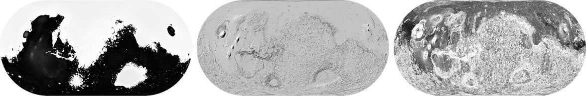

#### Orthographic maps of Mars
In addition to the main Eckert IV map, I also mapped the four hemispheres of Mars (North, South, East, and West). The Eckert IV map isn't great for visualizing the North and South poles, so those two insets were particularly important for understanding the polar regions. To make the hillshade and slope for each of the four corner maps, I repeated the same code as above, modified slightly for the `ortho` (Orthographic) projection and specifying the center latitude and longitude for each map (North:`+lat_0=90 +lon_0=90`, South :`+lat_0=-90 +lon_0=90`, East:`+lat_0=0 +lon_0=90`, West:`+lat_0=0 +lon_0=270`).

```bash
gdalwarp -t_srs "+proj=ortho +lat_0=90 +lon_0=0" ./path_to_intif.tif ./path_to_outtif.tif
gdalwarp -tr 1500 1500 -r average ./path_to_intif.tif ./path_to_outtif.tif
gdaldem hillshade -z 20 ./path_to_intif.tif ./path_to_hillshade.tif
gdaldem slope ./path_to_intif.tif ./path_to_slope.tif
```

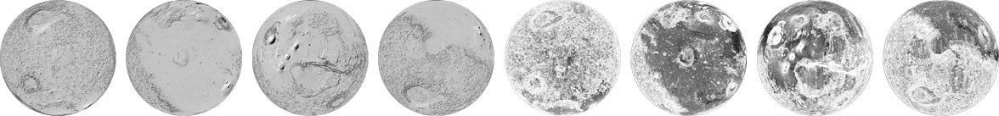

#### Planetary Nomenclature
The [International Astronomical Union](https://planetarynames.wr.usgs.gov/) is responsible for naming features of extraterrestrial objects. You can download a `CSV` file of all features from each planet from the IAU website. To do this, use the [Advanced Search Function](https://planetarynames.wr.usgs.gov/AdvancedSearch) to download `All Feature Types` from your `Target` (Mars) of only an Approval Status of `Adopted by IAU`. In the `Columns to Include` section, select `Feature ID`, `Feature Name`, `Clean Feature Name`, `Target`, `Diameter`, `Center Lat/Lon`, `Feature Type`, and `Feature Type Code`. You can also include `Origin` if you'd like additional information about each feature, such as who it is named after. The `Output Format` should be `CSV`.

#### Geologic structures and units
A geologic map shows different rock types and other features like fault lines and riverbeds. The USGS has a beautiful [Geologic Map of Mars](https://pubs.usgs.gov/sim/3292/), which I'm going to recreate from the same data in a different style. To work with this data, download the 790MB [Database ZIP](https://pubs.usgs.gov/sim/3292/downloads/sim3292_database.zip) from the USGS Geologic Map. The next section on *Map Design in Python* explains how to access and plot each type of data in this database.

## Map design in Python

Next, I made six Python plots with geologic units, geologic structures, geologic features, two types of text labels, and gridlines. I often split up data for plotting so I can easily apply section-specific effects in Photoshop or Illustrator. In `matplotlib` I used `gridspec` to set up my figures so that each of my subplots occupy the exact pixel locations inside my decorative border.

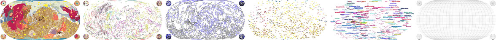

**Geologic units** are the different types of rock that make up the surface of the planet. Different rock units are usually represented by different colors. The USGS dataset tags each unit by a 2~3 letter code identifying the rock type. I assigned a color to each letter code by making a table of code-color pairs in `Mars_geologic_units.csv`. I referenced this file when plotting each unit in `cartopy` and `matplotlib`. Saving my graphics parameters in a separate file makes it easier to try different color schemes, and compartmentalizes the design from the code.

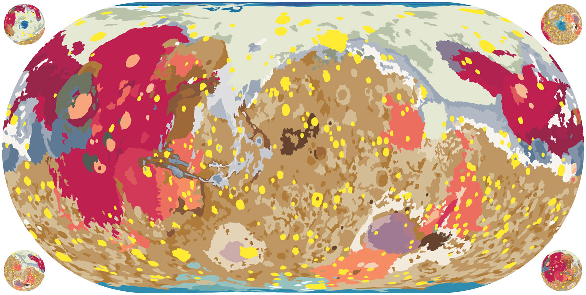

**Geologic contacts** are the boundaries between geologic units. Some geologic boundaries are approximate or hidden under dust. Similar to the geologic units, I use the `Mars_geologic_boundaries.csv` configuration file to map each type of geologic contact in a different color. In the final map I customized some of the geologic contacts into dotted lines by opening the `PDF` in Illustrator and selecting all objects of the same color (`Select` -> `Same` -> `Stroke color`).

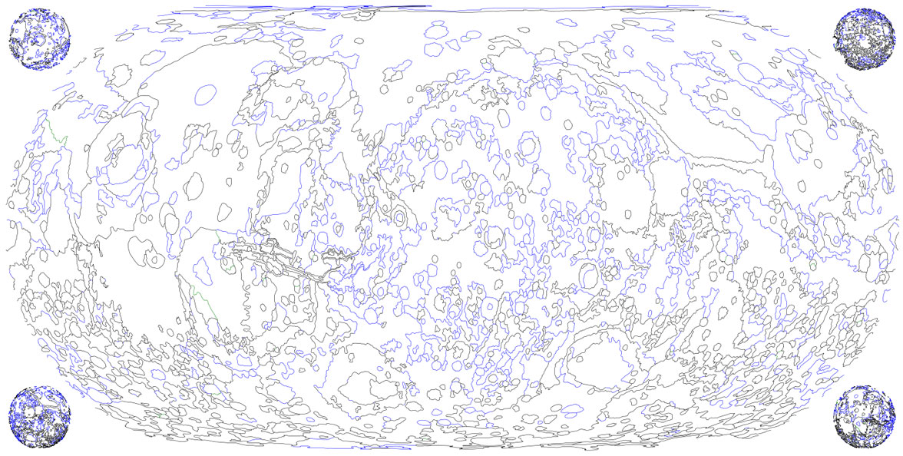

**Geologic features** are other visible lines on a planet's surface, like channels, crater rims, or ridges. There are 13 different feature types in this dataset. To map each of them in a distinct style, I plotted each one in a different color, and then stylized the lines in Illustrator. This was useful for applying special effects, like the gradient tails to show the direction of motion of outflow channels and lava flows. The USGS also has helpful [scientific publishing guidelines](https://planetarymapping.wr.usgs.gov/Page/view/Guidelines) for geologic maps, if you'd like to use more conventional parameters.

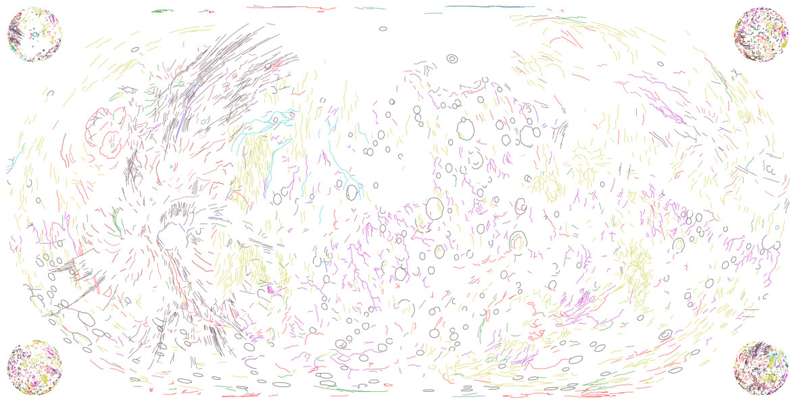

**Nomenclature:** There are two different kinds of text labels on this map. The first set are the official feature names downloaded from the IAU. The label sizes are plotted approximately according to the size of the object, though I changed the font sizes substantially in Illustrator after plotting them in Python.

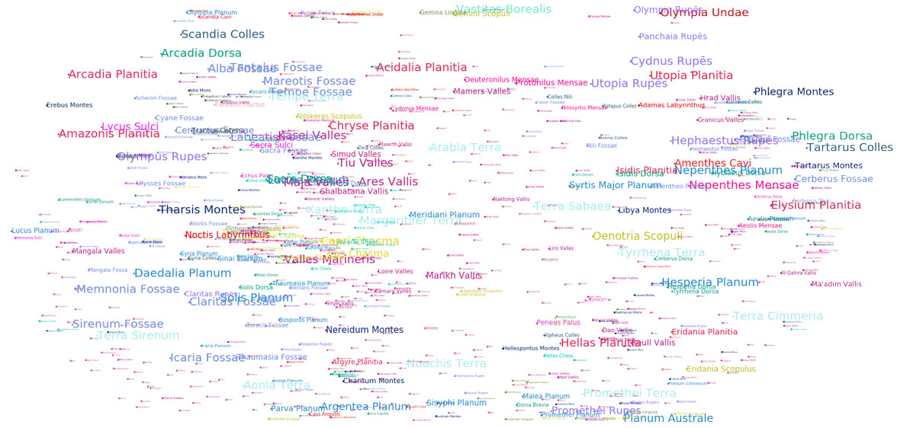

The second set of labels annotates each of the largest geologic units with the abbreviation for that type of rock. This makes it easier to use the key at the bottom of the map, since some of the colors are altered by the terrain shading. The code for this is a little bit hacky - I plotted each of the abbreviations at the centroid of the geologic shape, which wasn't necessarily the best place for all of the labels. But I decided this was an ok approach because I was planning to manually move the annotations around the map in any case (to avoid overlapping with the feature labels).

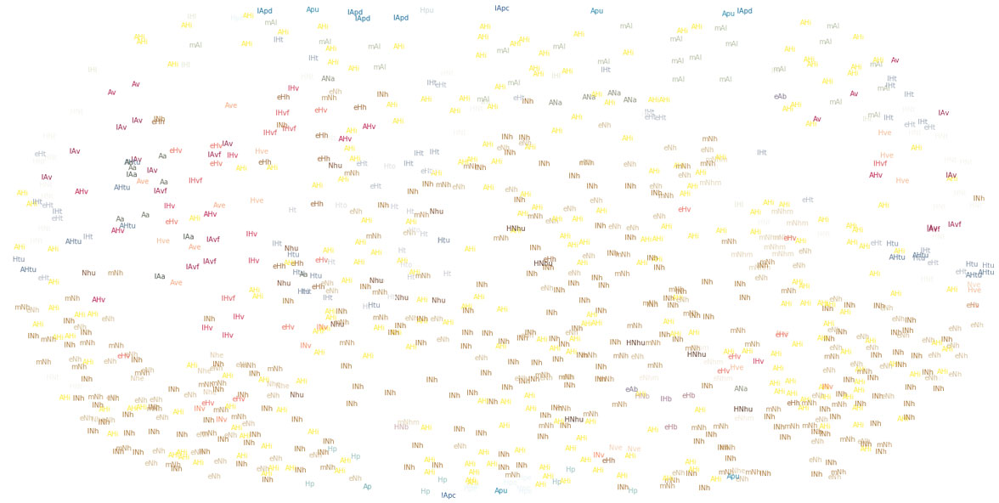

**Landing sites on Mars:** To map the landing sites of rovers and other spacecraft on Mars, I used a [digitally enhanced NASA image of Mars](https://astrogeology.usgs.gov/search/map/Mars/Viking/Color/Mars_Viking_ClrMosaic_global_925m) as the backdrop. To show all four hemispheres of the planet, I reprojected this image into four Orthographic projections in `landing_sites.ipynb`.

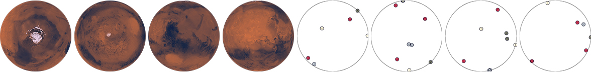

#### Saving Matplotlib figures

I usually save figures as a PDF so I can edit the text and shapes in Illustrator. There are a couple standard commands I use to export Matplotlib figures so they're easy to edit:

```python
import matplotlib
import matplotlib.pyplot as plt
import matplotlib.backends.backend_pdf as pdf

# Export text as editable text instead of shapes:
matplotlib.rcParams['pdf.fonttype'] = 42

# Preserve the vertical order of embedded images:
matplotlib.rcParams['image.composite_image'] = False

# Remove borders and ticks from subplots:
ax.axis('off')

# Remove padding and margins from the figure and all its subplots
plt.margins(0,0)
plt.subplots_adjust(top=1, bottom=0, right=1, left=0, hspace=0, wspace=0)
plt.gca().xaxis.set_major_locator(plt.NullLocator())
plt.gca().yaxis.set_major_locator(plt.NullLocator())

# Save the Matplotlib figure as a PDF file:
pp = pdf.PdfPages('./savename.pdf', keep_empty=False)
pp.savefig(fig)
pp.close()

# If I don't need to edit vector paths I save the file as a
# PNG so I can import it directly into Photoshop:
plt.savefig('./savename.png', format='png', dpi=600, pad_inches=0, transparent=True)
```

After saving the figure, the `PDF` file needs to be edited so that each object can be manipulated individually. In Illustrator,  select everything in the file and then go to `Object` --> `Clipping Mask` --> `Release`. At this point you can also delete the background and axis border objects, if you included them in the output file.

<a name="illustrator_photoshop"/>

## Map design in Illustrator and Photoshop

I export Python figures to Illustrator and Photoshop because several great design features are impossible or very time-consuming in Matplotlib. I'm linking tutorials here for the features I use most often - [font alternates](https://helpx.adobe.com/illustrator/using/special-characters.html) and [ligatures](https://helpx.adobe.com/illustrator/using/special-characters.html#use_ligatures_and_contextual_alternates), [custom brushes](https://helpx.adobe.com/illustrator/using/brushes.html), [layering effects](https://helpx.adobe.com/photoshop/using/layer-effects-styles.html), [blur effects](https://helpx.adobe.com/photoshop/using/blur-gallery.html), [gradients along a path](http://blog.gilbertconsulting.com/2017/06/using-gradients-on-strokes-in.html), [variable width paths](https://iamsteve.me/blog/entry/creating-custom-stroke-width-profiles-in-illustrator), [type on a path](https://helpx.adobe.com/illustrator/using/creating-type-path.html), and [selecting objects by characteristic](https://helpx.adobe.com/illustrator/using/selecting-objects.html#select_objects_by_characteristic).


This project didn't have many special text effects, so the editing in Illustrator and Photoshop was minimal compared to some of my other maps.

#### Layering in Photoshop

I've included a small section of the map in the `figures` folder as the Photoshop file `mars_geology_sample.psd`. The file is small enough to upload online, but since it still has the original layers you should be able to use it as a reference for layering effects.

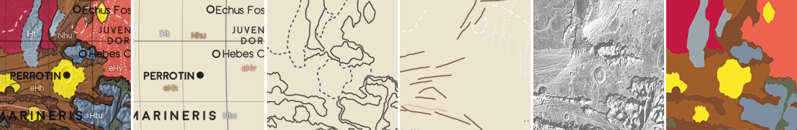

#### Shadows Underneath Text Labels in Photoshop

To create a shadow effect around the text labels, duplicate the annotation layer and go to `Filter` --> `Blur Gallery` --> `Field Blur`. For shadow text I usually create two blur layers set to 20% opacity - one with a `Blur` of 4px and the other 10px.

#### Color and Font

I wanted the maps in this series to look cohesive, so I made a palette of ~70 different colors and picked from these choices in every map. I also used the same two fonts ([Redflowers](https://creativemarket.com/TypeandStudio/923689-RedFlower-Typeface) and [Moon](https://harvatt.house/store/moon-font)) in all maps. You're welcome to use the color palette and font styling if you'd like.


#### Designing a color scheme

To develop this set of colors, I started the project by designing 14 different color schemes. My initial idea was to have a unique color palette for every planet, but in the end I used the same collection of colors throughout all of the projects to make the maps look more cohesive.


Each color palette is shown in several different ways, because I wanted to design versatile color schemes that could work as discrete elements, or as pieces of a complex pattern, or as a gradient in topographic maps. I updated these three visualizations while designing to make sure each color scheme would work for each application.

#### Decorative illustrations in Photoshop

For this project I wanted to combine large datasets with the hand-crafted design style of artists like William Morris or Alphonse Mucha. To organize my thoughts I collected a big folder of inspiration images from sources like the [New York Public Library Digital Database](https://www.nypl.org/):


When I started this project I initially wanted to design different border decorations for every topic. I sketched a collection of 18 different repeated patterns, each meant to go alongside a unique astronomy theme like planets, galaxies, space missions, or satellites.


But as the project continued I realized there was so much data that the detailed borders made the maps look too cluttered. In the end I removed all of the borders and designed just one scrollwork illustration to wrap around rounded map projections. In these round maps I thought the shift from detailed map to blank paper was a bit too abrupt, so this was a good compromise between data-heavy and illustrative design styles.


For this scrollwork design I started with a pencil sketch, and tried a couple different iterations of leafy scrolls before finally picking a less botanically inspired design. When I paint decorations like these in Photoshop, I begin each design as a solid white shape and then gradually break away pieces into detailed chunks. Next, I brush away pieces of each section with the brush eraser tool until the pieces look like a fully-shaded monochrome design. I wait to add color until the very last step, where I use many different colors and overlay layers for a richer effect.

I've included two different examples of these painted Photoshop illustrations in the `figures` folder as `scrollwork_sample.psd` and `decorations_sample.psd`. These files still have the original layers, so you should be able to use it as a reference for layering, painting, and color effects.


<a name="references"/>

## References
- [Astronomy](https://openstax.org/details/astronomy). Andrew Fraknoi, David Morrison, Sidney C. Wolff et al. OpenStax 2016.
- [Gazetteer of Planetary Nomenclature](https://planetarynames.wr.usgs.gov/). International Astronomical Union (IAU) Working Group for Planetary System Nomenclature (WGPSN) 2019.
- [Planetary Symbology Mapping Guidelines](https://planetarymapping.wr.usgs.gov/Page/view/Guidelines). Federal Geographic Data Committee.
- [Mars HRSC MOLA Blended DEM Global 200m v2](https://astrogeology.usgs.gov/search/map/Mars/Topography/HRSC_MOLA_Blend/Mars_HRSC_MOLA_BlendDEM_Global_200mp_v2). NASA PDS and Derived Products Annex. USGS Astrogeology Science Center 2018.
- [Geologic Map of Mars SIM 3292](https://pubs.usgs.gov/sim/3292/). Kenneth L. Tanaka, James A. Skinner, Jr., James M. Dohm, Rossman P. Irwin, III, Eric J. Kolb, Corey M. Fortezzo, Thomas Platz, Gregory G. Michael, and Trent M. Hare. USGS 2014.
- [Viking Global Color Mosaic 925m v1](https://astrogeology.usgs.gov/search/map/Mars/Viking/Color/Mars_Viking_ClrMosaic_global_925m). NASA PDS, 2019
- [Missions to Mars](http://www.planetary.org/explore/space-topics/space-missions/missions-to-mars.html). The Planetary Society.
- **Fonts:** [Moon](https://harvatt.house/store/moon-font) by Jack Harvatt and [RedFlower](https://creativemarket.com/TypeandStudio/923689-RedFlower-Typeface) by Type & Studio.
- **Advice:** Thank you to Henrik Hargitai, Oliver Fraser, Thomas Mohren, Chris Liu, Chloe Pursey, and Leah Willey for their helpful advice in making this map.

<a name="license"/>

## License

**Code:** All of the code in this repository is shared under the [GPL-3.0 license](https://www.gnu.org/licenses/gpl-3.0).

**Data:** The data in this repository belongs to the original authors of the data. Please use the references section to look up the original version. In cases where I edited or revised the data, I impose no additional restrictions to the original license. Any data files I created myself are shared under the [ODC Open Database License](https://opendatacommons.org/licenses/odbl/summary/).

**Artwork:** The artwork included in this repository are shared under a [Creative Commons Attribution-NonCommercial-NoDerivatives 4.0 International License](https://creativecommons.org/licenses/by-nc-nd/4.0/).
